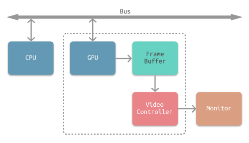
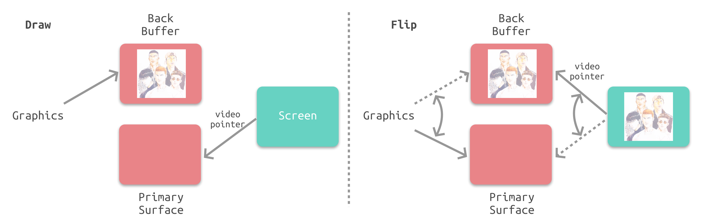

# 一、显示器原理

目前显示器大体分为**CRT显示器**和**液晶显示器**这两个种类：

#### 1.CRT显示器

CRT显示器是靠电子束激发屏幕内的荧光粉来显示图像的，屏幕上的每个像素里都有红绿蓝三种颜色的荧光粉，通过电压驱动电子枪发射三束电子束，分别轰击在像素里的三种颜色荧光粉上，通过调节电压大小来改变荧光粉的明暗，通过调节电压方向来改变电子束击打屏幕的位置，从而显示出完成的图像。

#### 2.液晶显示器

液晶是一种介于固体和液体之间的特殊物质，常态下呈液态，光线可以顺利透过。给液晶通电，会改变它的分子排列，再配合偏振光片，就可以改变它的透光性。

液晶显示器的工作原理就是通过改变加给液晶单元的电压，改变液晶单元的透光性，再配合滤光片，就可以在屏幕上显示画面。

#### 3.显示器刷新原理

为了把显示器的显示过程和系统的视频控制器进行同步，显示器（或者其他硬件）会用**硬件时钟**产生一系列的定时信号。

- HSync：当电子枪换到新的一行，准备进行扫描时，显示器会发出一个水平同步信号，简称 `HSync`（horizonal synchronization）。
- VSync：当一帧画面绘制完成后，电子枪回复到原位，准备画下一帧前，显示器会发出一个垂直同步信号，简称`VSync`（vertical synchronization）。

显示器通常以“固定频率“进行刷新，这个刷新率就是`VSync`信号产生的频率。  
iOS设备的屏幕刷新频率是每秒60帧，平均每16.67ms发出一个`VSync`。

<!-- more -->

# 二、CPU、GPU以及显示器的协作

CPU 计算好显示内容提交到 GPU，GPU 渲染完成后将渲染结果放入帧缓冲区，视频控制器收到VSync信号后逐行读取帧缓冲区的数据，再经过一定的数模转换传递给显示器显示。

解决画面撕裂问题：双缓存+VSyn

# 三、iOS屏幕刷新机制

iOS设备采取了如下图所示的**双缓存区+VSync**机制

- GPU 会预先渲染好一帧放入一个缓存区内（前帧缓存）。
- 在显示器发出`VSync`后，视频控制器的指针会指向前帧缓存区并开始读取，GPU开始渲染下一帧，并将渲染结果放入另一个缓存区（后帧缓存）。
- 在显示器发出新的`VSync`后，视频控制器的指针会指向后帧缓存区并开始读取，GPU开始渲染下一帧，并将渲染结果放入前帧缓存区。

###### 双缓存存在的问题：

由上文可知，每一帧画面要先经过CPU计算，再经过GPU渲染，最后存入缓存区供视频控制器读取。由于垂直同步的机制，如果在一个`VSync`时间内，CPU 或者 GPU 没有完成内容提交，则那一帧就会被丢弃，而这时显示屏会保留之前的内容不变，也就造成界面卡顿。

引用：

 https://www.jianshu.com/p/91d5cf01187c 
