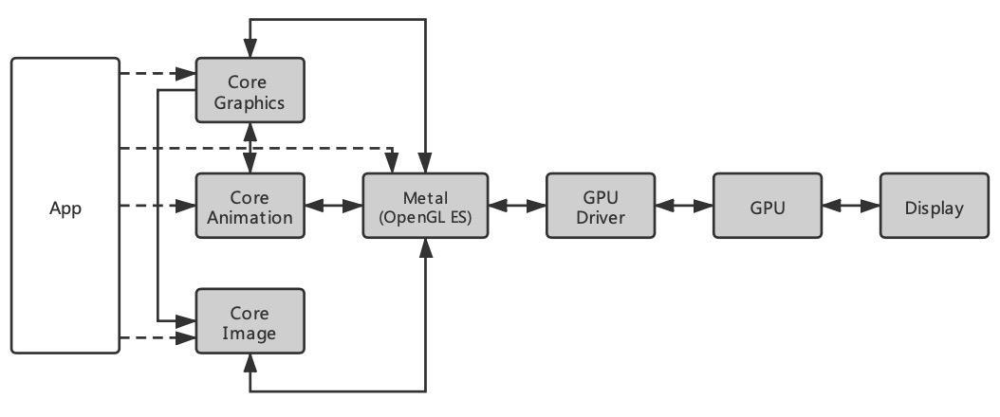
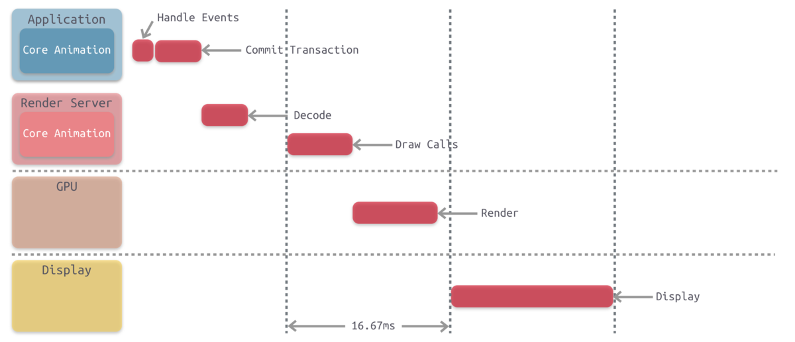

# iOS图层渲染流程

 UIView 的相关属性，是经过了一个**图形渲染**流程，才最终可以在屏幕上成像。本文主要介绍两部分内容：

1. iOS相关渲染框架

2. Core Animation Pipeline（Core Animation 流水线）

<!-- more -->

### 一、iOS渲染框架

下图所示为iOS图形渲染技术栈，App使用`Core Grapics`、`Core Animation`、`Core Image`等框架来绘制可视化内容。这些框架需要通过`Metal`（iOS12之前是通过`OpenGL ES`）来调用GPU进行绘制，最后将绘制好的内容显示在屏幕上。

- ###### UIKit

`UIKit`是iOS的基础视图框架，可以用来构建和管理界面可视化内容，响应用户交互事件。

`UIKit`自身并不具备在屏幕成像的能力，其主要负责**对用户交互事件的响应**（后面有时间再补一篇事件的传递和响应）。

`UIKit`中的每一个视图控件内部都有一个关联的 CALayer（后面有时间补一篇UIView和CALayer的联系），对视图控件的任何布局设置，本质上都是对其关联的CALayer进行操作。CALayer是App界面可视化内容的载体。

`UIKit`只支持iOS。

- ###### Core Aniamtion

`Core Animation`在开发中经常被用来实现动画效果，本质上是一个复合引擎，主要功能包含：**渲染**、**构建**和**实现动画**。它的职责是尽可能快地组合屏幕上不同的可视内容，这个组合过程是将这些内容分解成一个个独立的图层，并存储在一个叫做**图层树**的体系之中。和UIKit不同，Core Animation是直接作用于CALayer的。

`Core Animation`支持iOS和macOS。

- ###### Core Graphics

`Core Graphics` 是一个基于`Quartz 2D`的高级绘图引擎，提供大量的**低层次**、**轻量级**的2D渲染API。可以用来处理基于路径的绘图，转换，颜色管理，离屏渲染，图案，渐变和阴影，图像数据管理，图像创建，图像遮罩以及PDF文档的生成和解析。

`Core Graphics`支持iOS和macOS，在Mac OS X中，Core Graphics 还包括用于处理显示硬件，低级用户输入事件和窗口系统的服务。

- ###### Core Image

`Core Image`是iOS5中引入的一个图片处理框架，里面提供了很多强大高效的图像处理功能。Core Image 可以用来十分轻松地实现**滤镜**以及**图像识别**等功能。

- ###### OpenGL ES

`OpenGL ES`（OpenGL for Embedded Systems），是OpenGL三维图形API的⼦集，针对⼿机、Pad和游戏主机等嵌⼊式设备⽽设计，去除了许多不必要和性能较低的API接⼝。在 Metal 推出之前，iOS相关渲染框架都是基于 OpenGL ES 的。

- ###### Metal

`Metal`是Apple在WWDC 2014上为游戏开发者推出的新技术框架 ，只支持Apple相关平台。和OpenGL相比，Metal 能够为3D图像提高10倍的渲染性能。从iOS12开始，渲染框架底层都是基于 Metal 实现的。

- ###### GPU

`GPU`（Graphics Processing Unit），是一种可进行绘图、运算的专用微处理器，它的**高度并行结构**使其在大块数据并行处理的算法中比通用 CPU 更有效。

# 二、Core Animation Pipeline

上图描绘了Core Animation流水线的大概流程：

- App处理完事件，由Core Animation将渲染任务及相关数据提交给Render Server。

- Render Server生成渲染指令后，并打包传给GPU

- 再调用GPU渲染，

- 最后由iOS的图像设备进行显示。

下面是每个阶段棘突处理的任务：

##### 1. Application

在这个阶段，App响应用户事件后（如点击操作、滑动列表等），若需要更新界面内容，会通过`CPU`完成对显示内容的计算，如：布局计算、图片解码、图像绘制等。在完成对显示内容的计算之后，App将间接通过`UIKit`或直接通过`Core Animation`来更新**图层树**，最后将图层编码后的数据提交给`Render Server`。主要经历了下面两个步骤：

###### 1.1 Handle Events

App响应事件，并进行处理（如更新约束）。

###### 1.2 Commit Transaction

这个阶段细分成下面4步：

- ###### Layout

构建视图，包括：`layoutSubviews`方法的重载，`addSubview`: 方法填充子视图等。CPU在这里完成**视图布局**的相关计算。

- ###### Display

绘制视图，本质是绘制位图，设置最终成像的图元数据。重载`drawRect`方法可以完成自定义视图的绘制。CPU在这里完成**图像绘制**的相关计算。

- ###### Prepare

这个步骤会做一些额外的`Core Animation`工作，比如**图像解码**和**图像转换**。CPU会在这里对View里的图片进行解码，若CPU不支持该图片格式，则会先进行图像转换，再解码。

- ###### Commit

将图层进行编码打包，并提交给`Render Server`。由于图层是以树的结构存在，所以打包操作会递归执行。

##### 2. Render Server

`Render Server`，即**渲染服务器**，主要完成两个任务：

- ###### Decode

解码，将传入的图层信息进行解析并反序列化成**渲染树**（`render tree`)。

- ###### Draw Calls

根据渲染树中图层的相关设置属性来生成相应的渲染指令(`Metal`或`OpenGL ES`)，并将渲染相关信息传给GPU。

##### 3. GPU

`GPU`接收到`Render Server`传来的渲染信息后，会在收到显示器发送新的`VSync`信号后才进行渲染，并将渲染结果输出到帧缓冲区（即显存）。

##### 4. Display

在接受到显示器发出的新的`VSync`信号后，**视频控制器**会逐行读取帧缓冲区中的数据，再经过一定的数模转换传递给显示器显示。这个阶段的详情步骤可阅读[iOS 屏幕图像显示原理](https://www.jianshu.com/p/91d5cf01187c)。

作者：东篱采桑人  
链接：https://www.jianshu.com/p/cfb08dc42a4e  
来源：简书  
著作权归作者所有。商业转载请联系作者获得授权，非商业转载请注明出处。

# 总结

综上可知，App界面内容显示到屏幕上的流程如下：

1. `App`响应交互事件，如：用户的点击操作，需要更新界面布局。
2. `App`通过`CPU`完成对显示内容的计算，如：布局计算、图片解码、图像绘制等。在完成计算后，App更新图层树，并将图层树进行编码打包，然后将数据提交给`Render Server`。
3. `Render Server`将图层数据解码后，生成相应的渲染指令，然后将渲染信息传给`GPU`。
4. `GPU`完成渲染后会将渲染结果存入帧缓存区，再由视频控制器逐行读取数据，经由数模转换后将图像显示在屏幕上。

引用：

https://www.jianshu.com/p/cfb08dc42a4e
