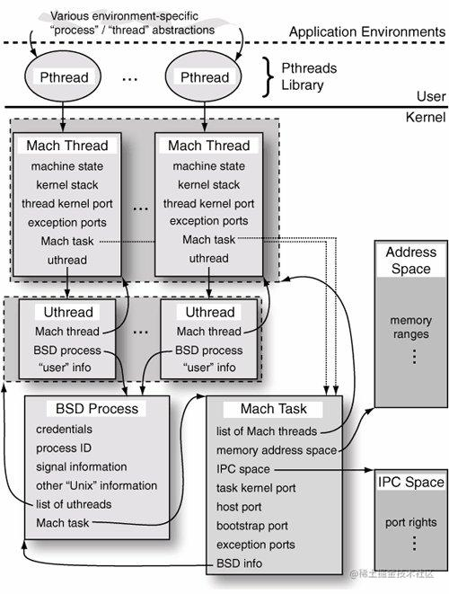
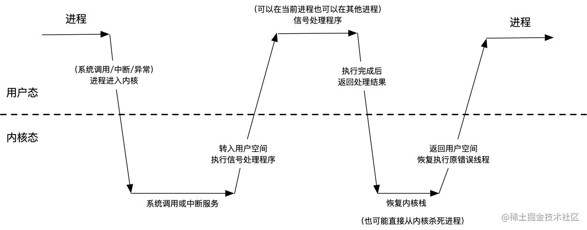

# Task & Thread & Process的区别

iOS操作系统内核为XNU（混合内核），而XNU的核心为Mach微内核。

### Process

用户角度：一个可执行程序的一个实例就是一个进程，使用PID标识
BSD层的Process：内部包含多个线程，和Mach Task一一对应

### Task

Mach Task是系统资源的集合，包含：一个虚拟的地址空间（分配内存），一个端口权限名称空间，一个或多个线程。

Mach Task和Process的区别：Mach Task提供更少的功能。在Process中，有信号、组、文件描述符等。而Mach Task用于资源的分配和共享，它是资源的容器。

### Thread

iOS中的进程和POSIX线程（pthread）是分别基于Mach task和Mach thread的顶层实现。

<!-- more -->

# 异常

### 异常简述

应用通常运行在用户态。但是，当应用需要去主动使用系统调用，或被动遇到一些异常或者中断的时，应用由用户态进入到内核态，相当于系统收回了应用的运行权限

### 异常分类

1. 硬件异常：例如除0操作
2. 软件异常：给一个不存在的对象发送了消息

写的软件错误，可造成硬件异常，亦或是软件异常。而只有硬件异常才会发生上述的用户态到内核态的转化。

### Mach Exception

#### Mach Exception的传递

Mach内核提供了一个基于IPC的异常处理工具，其中异常被转化为message。

当异常发生时，一条包含异常的mach message，会被发送到一个异常端口。而线程（thread），任务（task），主机（host）都会维护一组异常端口，当Mach Exception机制传递异常消息的时候，它会按照thread → task → host 的顺序传递异常消息（这三者就是线程，进程，和系统的递进关系），如果这三个级别都没有处理异常成功，也就是收到KERN_SUCCESS 结果，那么内核就会终止该进程

#### 如何处理Mach Exception？

异常处理程序是mach message的接受者，它运行在自己的线程，虽然说它可以和发生异常的线程在同一个task中（也就是同一个进程中），但是它通常运行在其他的task中，比如说一个debugger。

如果一个线程想处理这个task的异常消息，那么就需要调用task_set_exception_ports() 来注册这个task的异常端口。这样的话，只要这个进程出现了硬件异常最后都会转化为Mach Exception Mesaage并传递给注册的端口，从而被异常处理程序接受到，处理接收到的异常消息。

#### Mach Exception分类

| Exception           | Notes                     |
| ------------------- | ------------------------- |
| EXC_BAD_ACCESS      | 无法访问内存                    |
| EXC_BAD_INSTRUCTION | 非法或者未定义的指令或者操作数           |
| EXC_ARITHMETIC      | 算术异常（例如被零除）               |
| EXC_EMULATION       | 遇到仿真支持指令                  |
| EXC_SOFTWARE        | 软件生成的异常（比如浮点数计算的异常）       |
| EXC_BREAKPOINT      | 跟踪或者断点（比如Xcode的断点，就会产生异常） |
| EXC_SYSCALL         | Unix系统调用                  |
| EXC_MACH_SYSCALL    | Mach系统调用                  |
| EXC_RPC_ALERTRPC    | 警告                        |

### Unix Signal

Mach已经提供了底层的异常机制，但是基于Mach exception，Apple在内核的BSD层上也建立了一套信号处理系统。这是为什么呢？

原因很简单，其实就是为了兼容Unix系统。而基于Linux的安卓也是兼容Unix的，所以安卓的异常也是抛出的Signal。当然这里得说明，在现代的Unix系统中，Mach异常只是导致信号生成的一类事件，还有很多其他的事件可能也会导致信号的生成，比如：显式的调用kill(2)或者killpg(2)、子线程的状态变化等等。

#### MachineException 转 Signal

Mach异常如果没有在其他地方（thread，task）得到处理，那么它会在ux_exception() 中将其转化为对应的Unix Signal信号，以下是两者之间的转化：

| Mach Exception      | Unix Signal                    | 原因                                                                                          |
| ------------------- | ------------------------------ | ------------------------------------------------------------------------------------------- |
| EXC_BAD_INSTRUCTION | SIGILL                         | 非法指令，比如除0操作，数组越界，强制解包可选形等等                                                                  |
| EXC_BAD_ACCESS      | SIGSEVG、SIGBUS                 | SIGSEVG、SIGBUS两者都是错误内存访问，但是两者之间是有区别的：SIGBUS（总线错误）是内存映射有效，但是不允许被访问； SIGSEVG（段地址错误）是内存地址映射都失效 |
| EXC_ARIHMETIC       | SIGFPE                         | 运算错误，比如浮点数运算异常                                                                              |
| EXC_EMULATION       | SIGEM                          | Thardware emulation 硬件仿真指令                                                                  |
| EXC_BREAKPOINT      | SIGTRAP                        | trace、breakpoint等等，比如说使用Xcode的断点                                                            |
| EXC_SOFTWARE        | SIGABRT、SIGPIPE、SIGSYS、SIGKILL | 软件错误，其中SIGABRT最为常见。                                                                         |

#### 软件异常转Signal

除了上述引发CPU Trap的异常之外，还有一类异常是软件异常，这一类异常并不会让进程进入内核态，所以它也并不会转化为Mach Exception，而是会直接转化为Unix Signal。而由Objective-C产生的异常就是软件异常这一类，它将直接转换为Signal信号，比如给对象发送未实现的消息，数组索引越界直接引发SIGABRT信号，作为对比Swift的数组异常会导致CPU Trap，转化为EXC_BAD_INSTRUCTION异常消息。

#### Mach Exception和Unix Signal的区别

Mach Exception的处理机制中异常处理程序可以在自己创建的处理线程中运行，而该线程和出错的线程甚至可以不在一个task中，即可以不在一个进程中，因此异常处理不需要错误线程的资源来运行，这样可以在需要的时候直接获得错误线程的异常上下文

而Unix Signal的处理无法运行在其他的线程，只能在错误线程上处理

所以Mach异常处理机制的优势是很明显的，比如说debugging场景，我们平时打断点的时候，其实程序运行到这里的时候会给Xcode这个task中的注册异常端口发EXC_BREAKPOINT消息，而Xcode收到之后，就会暂停在断点处，在处理完之后（比如点击跳过断点），将发送消息返回到Xcode，Xcode也将继续跑下去。

# iOS异常捕获三方

1. SKCrash

2. PLCrashReport

# 参考

[你真的懂iOS的异常捕获吗？ - 掘金](https://juejin.cn/post/7142656591139962888)
